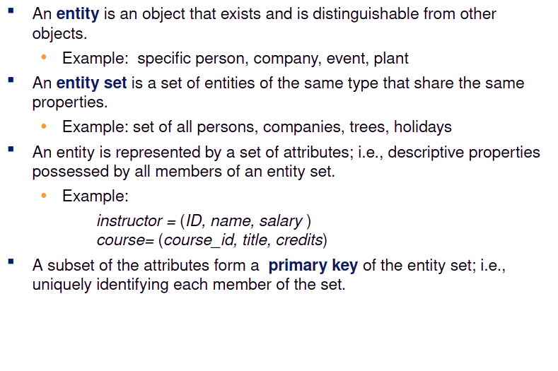

# Introduction

#### Outline

* [ ] Database-System Applications
* [ ] Purpose of Database Systems
* [ ] View of Data
* [ ] Database Languages
* [ ] Database Design
* [ ] Database Engine
* [ ] Database Architecture
* [ ] Database Users and Administrators
* [ ] History of Database Systems

### &#x20;Database Systems

* DBMS contains information about a particular enterprise
  * Collection of interrelated data
  * Set of programs to access the data
  * An environment that is both convenient and efficient to use
* Database systems are used to manage collections of data that are:
  * Highly valuable
  * Relatively large
  * Accessed by multiple users and applications, often at the same time.
* A modern database system is a complex software system whose task is to manage a large, complex collection of data.
* Databases touch all aspects of our lives

### &#x20;Database Applications Examples

* Enterprise Information
  * Sales: customers, products, purchases
  * Accounting: payments, receipts, assets
  * Human Resources: Information about employees, salaries, payroll taxes.
* Manufacturing: management of production, inventory, orders, supply chain.
* Banking and finance
  * customer information, accounts, loans, and banking transactions.
  * Credit card transactions
  * Finance: sales and purchases of financial instruments (e.g., stocks and bonds; storing real-time market data
* Universities: registration, grades
* Airlines: reservations, schedules
* Telecommunication: records of calls, texts, and data usage, generating monthly bills, maintaining balances on prepaid calling cards
* Web-based services
  * Online retailers: order tracking, customized recommendations
  * Online advertisements
* Document databases
* Navigation systems: For maintaining the locations of varies places of interest along with the exact routes of roads, train systems, buses, etc.

### Purpose of Database Systems

In the early days, database applications were built directly on top of file systems, which leads to:

* Data redundancy and inconsistency: data is stored in multiple file formats resulting induplication of information in different files
* Difficulty in accessing data
  * Need to write a new program to carry out each new task
* Data isolation
  * Multiple files and formats
*   Integrity problems

    * Integrity constraints (e.g., account balance > 0) become “buried” in program code rather than being stated explicitly
    * Hard to add new constraints or change existing ones


    ```
    Database systems offer solutions to all the above problems
    ```

### University Database Example

* In this text we will be using a university database to illustrate all the concepts
* Data consists of information about:
  * Students
  * Instructors
  * Classes
* Application program examples:
  * Add new students, instructors, and courses
  * Register students for courses, and generate class rosters
  * Assign grades to students, compute grade point averages (GPA) and generate transcripts

### View of Data

* A database system is a collection of interrelated data and a set of programs that allow users to access and modify these data.
* A major purpose of a database system is to provide users with an abstract view of the data.
  * Data models
    * A collection of conceptual tools for describing data, data relationships, data semantics, and consistency constraints.
  * Data abstraction
    * Hide the complexity of data structures to represent data in the database from users through several levels of data abstraction.

### Data Models

* A collection of tools for describing
  * Data
  * Data relationships
  * Data semantics
  * Data constraints
* Relational model
* Entity-Relationship data model (mainly for database design)
* Object-based data models (Object-oriented and Object-relational)
* Semi-structured data model (XML)
* Other older models:
  * Network model
  * Hierarchical model

### &#x20;Relational Model

* All the data is stored in various tables.
* Example of tabular data in the relational model

<figure><figcaption></figcaption></figure>

### &#x20;A Sample Relational Database

<figure><figcaption></figcaption></figure>

### &#x20;Levels of Abstraction

<figure><figcaption></figcaption></figure>

### View of Data

An architecture for a database system

<figure><figcaption></figcaption></figure>

### &#x20;Instances and Schemas

* &#x20;Similar to types and variables in programming languages
* Logical Schema – the overall logical structure of the database
  * Example: The database consists of information about a set of customers and accounts in a bank and the relationship between them
    * Analogous to type information of a variable in a program
* Physical schema – the overall physical structure of the database
* Instance – the actual content of the database at a particular point in time
  * Analogous to the value of a variable

### Physical Data Independence

* Physical Data Independence – the ability to modify the physical schema without changing the logical schema
  * Applications depend on the logical schema
  * In general, the interfaces between the various levels and components should be well defined so that changes in some parts do not seriously influence others.

### Data Definition Language (DDL)

<figure><figcaption></figcaption></figure>

### &#x20;Data Manipulation Language (DML)

<figure><figcaption></figcaption></figure>

### SQL Query Language

<figure><figcaption></figcaption></figure>

### &#x20;Database Access from Application Program

* Non-procedural query languages such as SQL are not as powerful as a universal Turing machine.
* SQL does not support actions such as input from users, output to displays, or communication over the network.
* Such computations and actions must be written in a host language, such as C/C++, Java or Python, with embedded SQL queries that access the data in the database.
* Application programs -- are programs that are used to interact with the database in this fashion.

### &#x20;Database Design

The process of designing the general structure of the database:

Logical Design – Deciding on the database schema. Database design requires that we find a “good” collection of relation schemas.\
Business decision – What attributes should we record in the database?\
Computer Science decision – What relation schemas should we have and how should the attributes be distributed among the various relation schemas?\
Physical Design – Deciding on the physical layout of the database

### Centralized databases


*
  *
    * One to a few cores, shared memory

### Client-server,

*
  *
    * One server machine executes work on behalf of multiple client machines.

### Parallel databases

*
  *
    * Many core shared memory
    * Shared disk
    * Shared nothing

### Distributed databases

*
  *
    * Geographical distribution
    * Schema/data heterogeneity

## Database Architecture

>) >) >) >) >)

**(Centralized/Shared-Memory)**

Database applications are usually partitioned into two or three parts

* Two-tier architecture -- the application resides at the client machine, where it invokes database system functionality at the server machine
* Three-tier architecture -- the client machine acts as a front end and

does not contain any direct database calls.

*
  * The client end communicates with an application server, usually through a forms interface.
  * The application server in turn communicates with a database system to access data.

>) >)

>) >) >) >) >) >) >) >)

>) >)

>) >)

>)

**Database System Concepts - 7th Edition**

**1.32**

**©Silberschatz, Korth and Sudarshan**

A person who has central control over the system is called a **database**

\*\*administrator (DBA).\*\*Functions of a DBA include:

* Schema definition
* Storage structure and access-method definition
* Schema and physical-organization modification
* Granting of authorization for data access
* Routine maintenance
* Periodically backing up the database
* Ensuring that enough free disk space is available for normal operations, and upgrading disk space as required
* Monitoring jobs running on the database
* 1950s and early 1960s:
  * Data processing using magnetic tapes for storage
    * Tapes provided only sequential access
  * Punched cards for input
* Late 1960s and 1970s:
  * Hard disks allowed direct access to data
  * Network and hierarchical data models in widespread use
  * Ted Codd defines the relational data model
    * Would win the ACM Turing Award for this work
    * IBM Research begins System R prototype
    * UC Berkeley (Michael Stonebraker) begins Ingres prototype
    * Oracle releases first commercial relational database
  * High-performance (for the era) transaction processing
* 1980s:
  * Research relational prototypes evolve into commercial systems
    * SQL becomes industrial standard
  * Parallel and distributed database systems
    * Wisconsin, IBM, Teradata
  * Object-oriented database systems
* 1990s:
  * Large decision support and data-mining applications
  * Large multi-terabyte data warehouses
  * Emergence of Web commerce
* 2000s
  * Big data storage systems
    * Google BigTable, Yahoo PNuts, Amazon,
    * “NoSQL” systems.
  * Big data analysis: beyond SQL
    * Map reduce and friends
* 2010s
  * SQL reloaded
    * SQL front end to Map Reduce systems
    * Massively parallel database systems
    * Multi-core main-memory databases


**End of Chapter 1**
